# MemRoach

**Unkillable memory for AI agents.** CockroachDB-backed memory system with hybrid search, knowledge graph, memory decay, cross-machine sync, and team sharing.

## What is MemRoach?

AI coding agents (Claude Code, Cursor, etc.) store memory, skills, settings, and session history as local files. Switch machines and everything is gone. MemRoach solves this:

- **MCP server** (primary) — any MCP-compatible client gets full memory access
- **File sync** (Claude Code convenience) — bidirectional sync of `~/.claude/` to CockroachDB
- **Hybrid search** — vector embeddings (OpenAI / Voyage AI) + keyword matching
- **Knowledge graph** — typed links between memories (relates_to, supersedes, etc.)
- **Memory decay** — identifies old, rarely-accessed memories for compaction
- **Smart priming** — auto-loads relevant context at session start
- **Team sharing** — per-memory visibility controls (private/team)
- **Cross-machine sync** — UUID-based machine identity, conflict detection, auto-merge
- **Real-time sync daemon** — background watcher for instant cross-machine updates
- **Version history** — full changelog for every memory

## Architecture

```
┌──────────────┐  ┌──────────────┐  ┌──────────────┐
│ Claude Code  │  │   Cursor     │  │  Any MCP     │
│              │  │              │  │  Client       │
└──────┬───────┘  └──────┬───────┘  └──────┬───────┘
       │                 │                 │
       │  MCP            │  MCP            │  MCP
       ▼                 ▼                 ▼
┌─────────────────────────────────────────────────────┐
│  memroach_mcp_server.py (PRIMARY INTERFACE)         │
│  16 tools: search, store, graph, prime, compact...  │
└──────────────────────┬──────────────────────────────┘
                       │ pg8000 (TLS)
                       ▼
┌─────────────────────────────────────────────────────┐
│  CockroachDB (per-user accounts)                    │
│  ├── memroach_blobs (content-addressable, gzip)     │
│  ├── memroach_files (metadata + visibility + version)│
│  ├── memroach_embeddings (vector search)            │
│  ├── memroach_history (version changelog)           │
│  ├── memroach_links (knowledge graph)               │
│  ├── memroach_access (read tracking / decay)        │
│  └── memroach_log (audit trail)                     │
└─────────────────────────────────────────────────────┘
                       ▲
                       │ pg8000 (TLS)
┌──────────────────────┴──────────────────────────────┐
│  memroach_sync.py (CLAUDE CODE CONVENIENCE)         │
│  CLI: push, pull, status, search, history, share    │
│  Hooks: auto-push on Stop, auto-pull on Start       │
└─────────────────────────────────────────────────────┘
                       ▲
┌──────────────────────┴──────────────────────────────┐
│  memroach_daemon.py (BACKGROUND SYNC)               │
│  Polls for cross-machine changes, auto-pulls        │
└─────────────────────────────────────────────────────┘
```

## Quick Start

### 1. Install dependencies

```bash
python3 -m venv venv
source venv/bin/activate
pip install -r requirements.txt
```

### 2. Configure

```bash
cp memroach_config.json.example memroach_config.json
# Edit with your CockroachDB credentials
```

### 3. Initialize schema

```bash
cockroach sql --url "postgresql://user@host:26257/memroach?sslmode=verify-full" \
  < schema/memroach_schema.sql
```

### 4. First sync

```bash
python memroach_sync.py init     # Test connectivity, generate machine_id
python memroach_sync.py push     # Upload ~/.claude/ to DB
```

### 5. Register MCP server

Add to your `.mcp.json` (Claude Code) or Cursor MCP config:

```json
{
  "mcpServers": {
    "memroach": {
      "command": "/path/to/memroach/venv/bin/python",
      "args": ["memroach_mcp_server.py"],
      "cwd": "/path/to/memroach"
    }
  }
}
```

### 6. (Optional) Enable embeddings

Set `embed_api_key` in `memroach_config.json` for hybrid search:

```json
{
  "embed_model": "text-embedding-3-small",
  "embed_api_key": "sk-..."
}
```

Supports both OpenAI (`text-embedding-3-small`) and Voyage AI (`voyage-3`).

## CLI Commands

```bash
memroach init                          # Test DB connectivity, generate machine_id
memroach push                          # Upload changed files to DB
memroach push --force                  # Skip version checks (last-write-wins)
memroach push --dry-run                # Show what would be pushed
memroach pull                          # Download latest from all machines
memroach pull --force                  # Overwrite even if local is newer
memroach status                        # Show sync status
memroach diff                          # Detailed differences (alias: status -v)
memroach search "auth patterns"        # Hybrid semantic + keyword search
memroach history path/to/file.md       # Version changelog for a file
memroach share path/to/file --team     # Make a memory team-visible
memroach share path/to/file --private  # Restrict visibility
```

## MCP Tools

### Core

| Tool | Description |
|------|-------------|
| `memroach_search(query)` | Hybrid vector + keyword search across all memories |
| `memroach_get(file_path)` | Fetch content of a specific memory/skill/config |
| `memroach_store(path, content)` | Store or update a memory directly |
| `memroach_list(file_type, filter)` | List entries, filterable by type and path pattern |
| `memroach_share(path, visibility)` | Change visibility (private/team) |
| `memroach_team(query)` | Search team-shared entries only |
| `memroach_history(file_path)` | Show version timeline with timestamps and operations |

### Knowledge Graph

| Tool | Description |
|------|-------------|
| `memroach_link(from, to, type)` | Create a typed link between two memories |
| `memroach_unlink(from, to)` | Remove a link |
| `memroach_graph(file_path)` | Show all incoming and outgoing links for a memory |

Link types: `relates_to` (bidirectional), `duplicates`, `supersedes`, `caused_by`, `refines`

### Intelligence

| Tool | Description |
|------|-------------|
| `memroach_prime(project_hint)` | Smart context priming — loads the most relevant memories for your session |
| `memroach_context(topic)` | Curated context bundle with full content for a specific topic |
| `memroach_consolidate(threshold)` | Find near-duplicate memories using embedding similarity |
| `memroach_merge(paths, content)` | Merge duplicates into one, with supersedes links |
| `memroach_compact(max_age_days)` | Find old, rarely-accessed memories for summarization |
| `memroach_changes(since_minutes)` | Check for recent changes from other machines |

## How It Works

### Hybrid Search

Combines two signals for ranking:

1. **Vector similarity** — embeds the query via OpenAI/Voyage API, cosine similarity against stored embeddings. Captures semantic meaning ("auth patterns" matches "OAuth middleware design").
2. **Keyword match** — full-text search on raw content. Catches exact terms vectors might miss.

Scoring: `final_score = (0.7 × vector_score) + (0.3 × keyword_score)`

### Knowledge Graph

Memories can be linked with typed relationships:

```
┌──────────────┐  relates_to  ┌──────────────┐
│ auth-patterns│◄────────────►│ oauth-setup  │
└──────────────┘              └──────────────┘
       │ supersedes
       ▼
┌──────────────┐
│ old-auth-doc │ (soft-deleted after merge)
└──────────────┘
```

Use `memroach_graph` to explore connections. `memroach_merge` automatically creates `supersedes` links when consolidating duplicates.

### Memory Decay / Compaction

MemRoach tracks every read via `memroach_access`. Over time, `memroach_compact` identifies memories that are:
- Old (not modified in N days)
- Large (above a size threshold)
- Rarely accessed

It returns the full content with instructions for the calling agent (Claude) to summarize and store back a compact version. The original is preserved in version history.

### Context Priming

`memroach_prime` combines four signals to select the most relevant memories:

| Signal | Weight | Description |
|--------|--------|-------------|
| Project match | 2.0 | Memories matching the project hint |
| Cross-machine changes | 1.5 | Recent updates from other devices |
| Recency | 1.0 | Recently modified memories |
| Access frequency | 0.8 | Most frequently read memories |

Returns full content + graph links, ready for consumption.

### Cross-Machine Sync

```
Machine A (push) ──► CockroachDB ──► Machine B (pull)
     │                                    │
     │ UUID machine_id prevents           │ Conflict detection:
     │ hostname collisions                │ both changed → merge or .conflict
     │                                    │
     │ Auto-push on Stop/SessionEnd       │ Auto-pull on first prompt
```

- **Machine identity**: UUID generated on first run (e.g., `MacBook-Pro-a1b2c3d4`), stored in config
- **Push**: only uploads files with changed SHA-256 hash, optimistic concurrency via version column
- **Pull**: fetches latest version across all machines, detects conflicts when both sides changed
- **Merge**: memory `.md` files get section-based auto-merge; other conflicts saved as `.conflict`
- **Auto-sync hooks**: push on Stop/SessionEnd, pull on first UserPromptSubmit per session

### Real-Time Sync Daemon

For continuous sync without hooks:

```bash
python memroach_daemon.py --daemonize --interval 60  # Poll every 60s
python memroach_daemon.py --status                    # Check if running
python memroach_daemon.py --stop                      # Stop daemon
```

The daemon polls CockroachDB for changes from other machines and auto-pulls them. Logs to `/tmp/memroach_daemon.log`.

## File Type Classification

Files are auto-classified by path pattern:

| Type | Path Pattern | Embedded? |
|------|-------------|-----------|
| `memory` | `*/memory/*.md`, `CLAUDE.md` | Yes |
| `skill` | `*/skills/` | Yes |
| `config` | `settings.json`, `mcp.json` | No |
| `session` | UUID directories | No |
| `file` | Everything else | No |

Only `memory` and `skill` files are embedded for semantic search.

## Auto-Sync via Claude Code Hooks

MemRoach automatically syncs across all Claude Code projects using global hooks.

### Setup

Add to `~/.claude/settings.json`:

```json
{
  "hooks": {
    "UserPromptSubmit": [
      {
        "hooks": [{
          "type": "command",
          "command": "/path/to/memroach/venv/bin/python /path/to/memroach/memroach_sync.py",
          "timeout": 15
        }]
      }
    ],
    "Stop": [
      {
        "hooks": [{
          "type": "command",
          "command": "/path/to/memroach/venv/bin/python /path/to/memroach/memroach_sync.py",
          "timeout": 10
        }]
      }
    ],
    "SessionEnd": [
      {
        "hooks": [{
          "type": "command",
          "command": "/path/to/memroach/venv/bin/python /path/to/memroach/memroach_sync.py",
          "timeout": 10
        }]
      }
    ]
  }
}
```

### Hook behavior

| Event | Action |
|-------|--------|
| `UserPromptSubmit` | Auto-pull once per session (first prompt only) |
| `Stop` | Auto-push in background after Claude responds |
| `SessionEnd` | Final push before session closes |

### Safety guarantees

The hook handler **never crashes or blocks**, even if:
- Config doesn't exist (logs "skipped", exits cleanly)
- DB is unreachable (background process fails silently)
- Config is invalid JSON (exits cleanly)
- Any unexpected error occurs (caught at outermost level)

### Disable auto-sync

```json
{
  "auto_push_on_stop": false,
  "auto_push_on_session_end": false,
  "auto_pull_on_start": false
}
```

## Database Schema

| Table | Purpose |
|-------|---------|
| `memroach_blobs` | Content-addressable store (SHA-256, gzip compressed) |
| `memroach_files` | File metadata, type, visibility, version, per user+machine |
| `memroach_embeddings` | Vector embeddings (1024-dim) for semantic search |
| `memroach_history` | Version changelog — every push records a history entry |
| `memroach_links` | Knowledge graph edges (typed relationships) |
| `memroach_access` | Read tracking for memory decay scoring |
| `memroach_log` | Audit trail (push/pull operations) |

## Configuration

`memroach_config.json`:

```json
{
  "db_host": "your-cockroachdb-host",
  "db_port": 26257,
  "db_user": "your_username",
  "db_password": "",
  "db_name": "memroach",
  "db_sslrootcert": "/path/to/ca.crt",
  "machine_id": "",
  "auto_push_on_stop": true,
  "auto_push_on_session_end": true,
  "auto_pull_on_start": true,
  "embed_model": "text-embedding-3-small",
  "embed_api_key": "",
  "exclude_patterns": [],
  "max_file_size_mb": 50
}
```

- `machine_id` — auto-generated UUID on first run. Do not share across machines.
- `embed_model` — `text-embedding-3-small` (OpenAI) or `voyage-3` (Voyage AI)
- `embed_api_key` — leave empty to disable hybrid search (keyword-only fallback)

## How Claude Uses MemRoach

MemRoach is designed to work transparently with Claude's existing memory system:

- **Saving memories** — Claude saves to `~/.claude/memory/` files as normal. Sync hooks automatically push to CockroachDB. No behavior change needed.
- **Retrieving memories** — Claude uses MCP tools (`memroach_search`, `memroach_prime`, `memroach_context`) for richer results than reading local files.
- **Advanced features** — Claude calls MCP tools for things files can't do: team sharing (`memroach_share`), knowledge graph links (`memroach_link`), duplicate consolidation (`memroach_consolidate`, `memroach_merge`).

See `CLAUDE.md` for the full decision guide.

## Web UI

MemRoach includes a built-in web dashboard for browsing, searching, and analyzing your memory system. No extra dependencies — it uses Starlette/uvicorn (already installed via `mcp[cli]`).

```bash
python memroach_web.py          # Starts on http://127.0.0.1:8080
python memroach_web.py --port 9090  # Custom port
```

Or use the Claude Code shortcut: `/memroach_web`

### Dashboard

Overview of your memory system — file counts by type, total storage, recent activity, and quick stats.

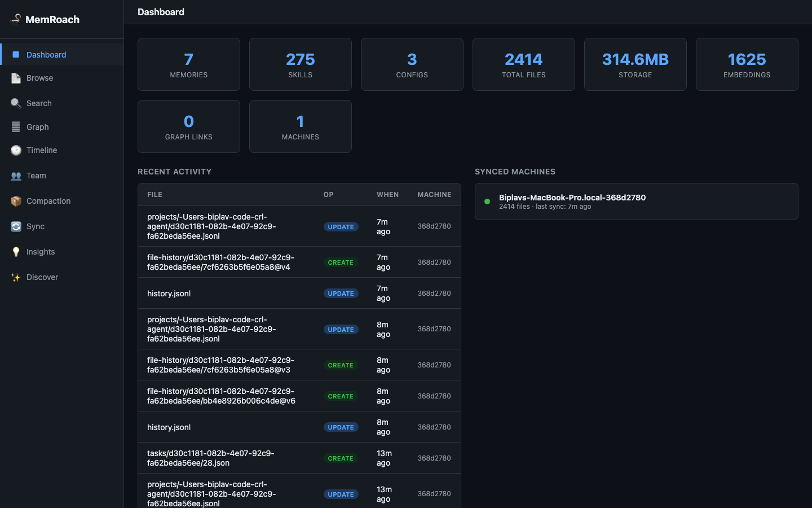

### Browse

Paginated file browser with sorting by name, type, size, or sync date. Click any file to open the Memory Viewer with full content, version history, and knowledge graph links.

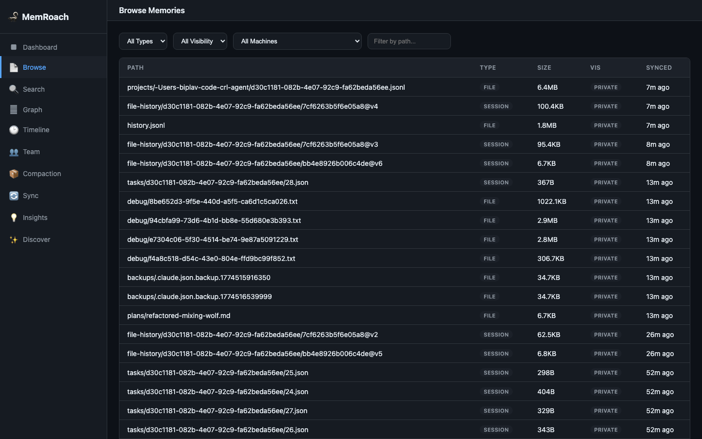

### Search

Hybrid semantic + keyword search across all memories. Results show file path, type, size, and relevance score.

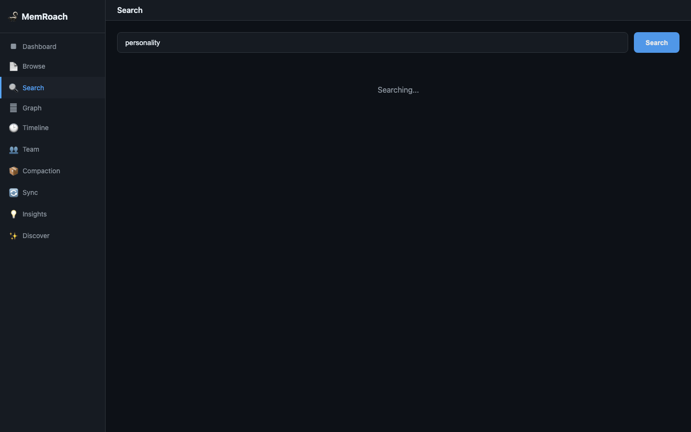

### Knowledge Graph

Interactive D3.js force-directed graph visualization of all memory links. Nodes are color-coded by file type, edges labeled with relationship type (relates_to, supersedes, duplicates, etc.).

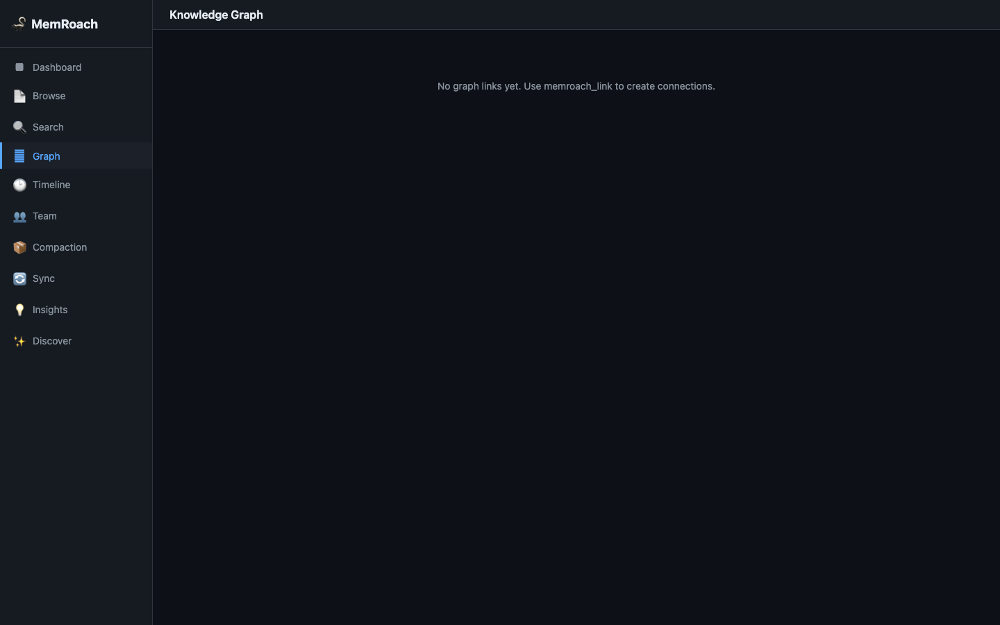

### Timeline

Chronological history of all memory operations (create, update, delete) across all files. Shows operation type, file path, and timestamp.

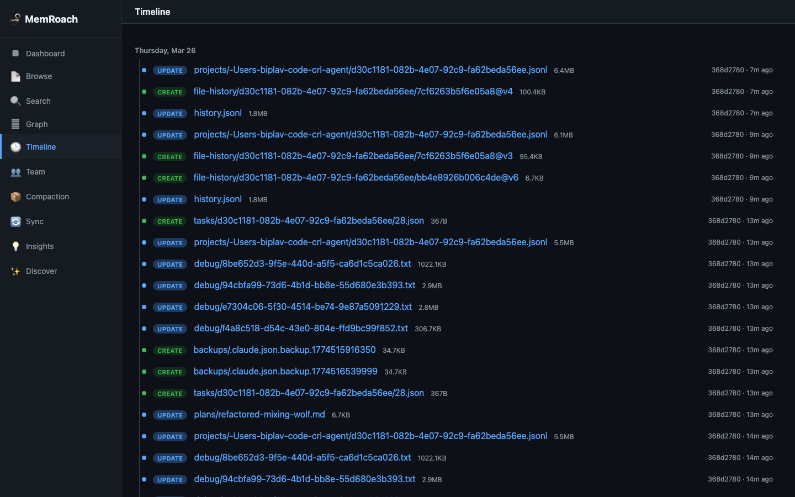

### Team

Browse and search team-shared memories. Shows visibility status and allows filtering by team vs private.

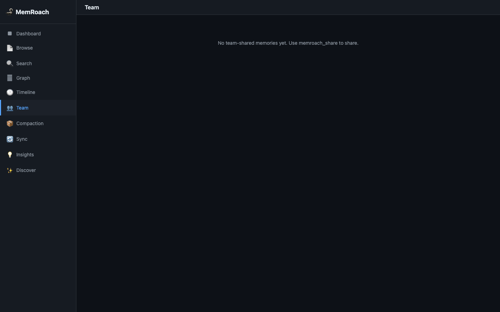

### Compaction

Identifies old, large, rarely-accessed memories that are candidates for summarization. Shows age, size, and access count for each candidate.

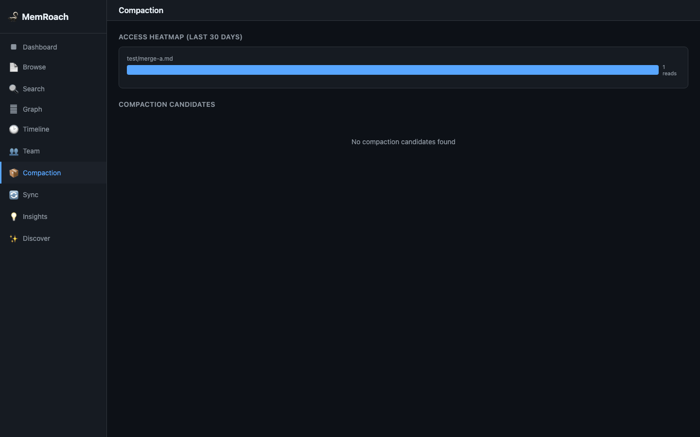

### Sync Status

Real-time view of sync state — last push/pull times, machine identity, pending changes, and daemon status.

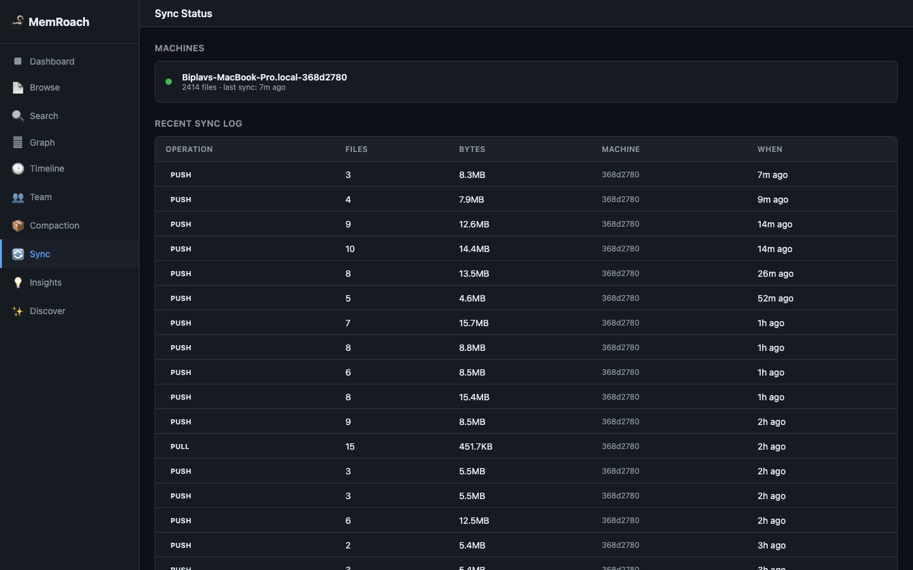

### Insights

#### Memory Health

Health report card with colored indicators for stale memories, orphaned files (no graph links), oversized files, version churn, and embedding coverage.

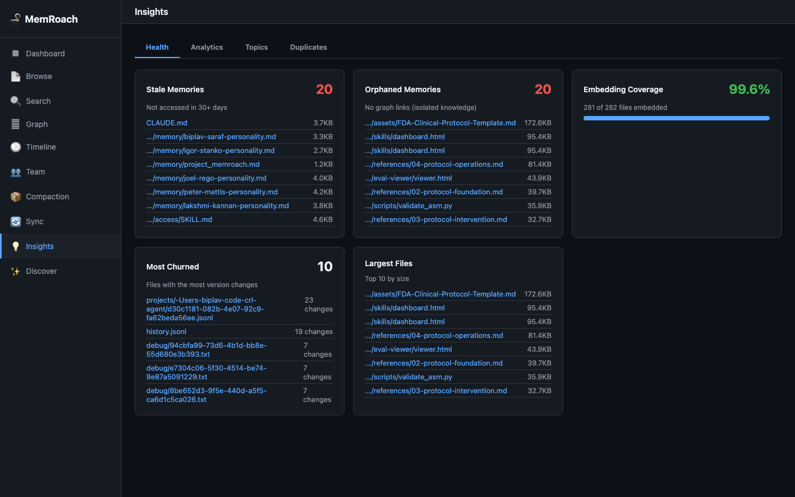

#### Growth & Activity Analytics

Daily activity charts showing creates, updates, and deletes over time. Includes machine activity breakdown and most-churned files.

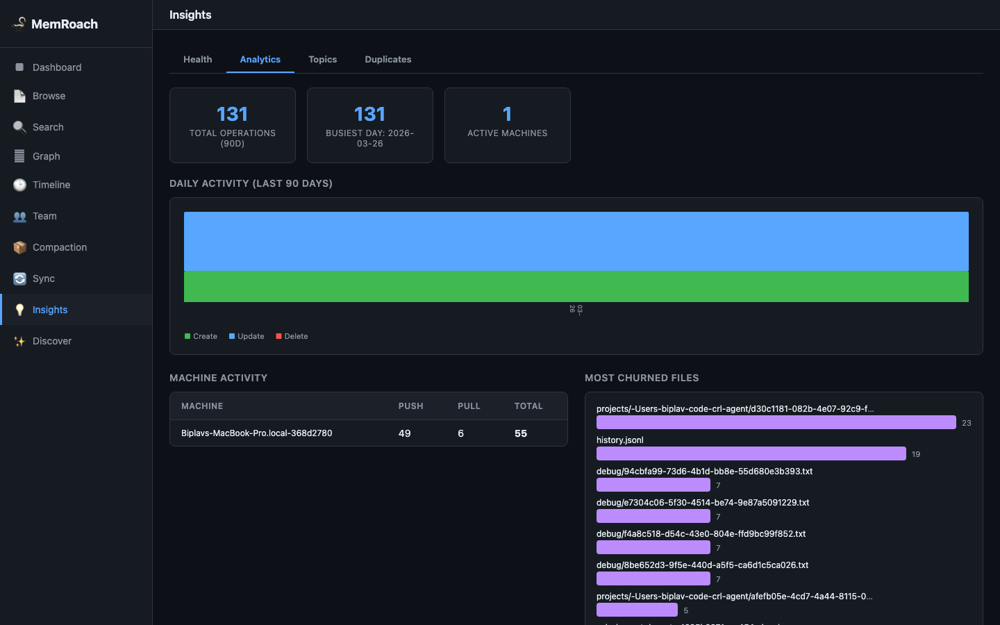

#### Topic Clusters

K-means clustering on embedding vectors groups memories into topics. Each cluster shows an auto-generated label (top keywords), file count, and representative files.


#### Duplicate Detection

Finds near-duplicate memories using embedding cosine similarity. Shows side-by-side snippets with similarity scores. Includes a merge button to consolidate duplicates directly from the UI.

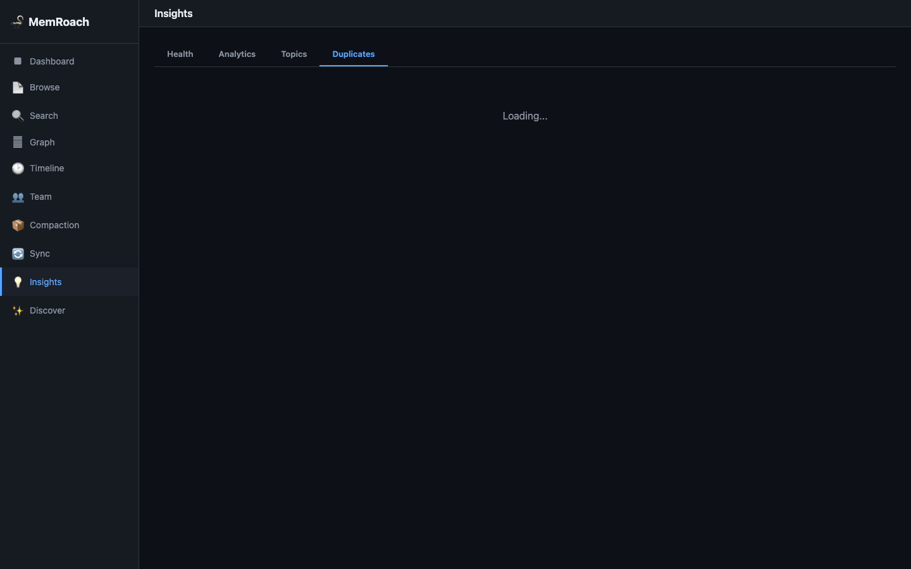

### Discover

Social-media-style "rediscover" feed that surfaces old, forgotten memories. Weighted random selection favors older and less-accessed files. Click "Next" to swipe through your memory archive.

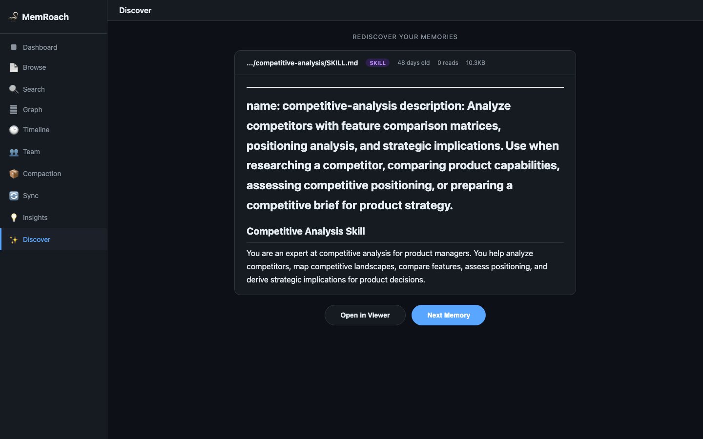

## File Layout

```
memroach/
├── memroach_mcp_server.py     # MCP server (16 tools)
├── memroach_sync.py           # File sync client + CLI + hooks
├── memroach_daemon.py         # Background sync daemon
├── memroach_web.py            # Web UI dashboard (single-file SPA)
├── memroach_embed.py          # Shared embedding module (OpenAI + Voyage)
├── memroach_admin.py          # User management (non-IdP fallback)
├── memroach_config.json       # Config (gitignored)
├── schema/
│   └── memroach_schema.sql    # CockroachDB DDL (7 tables)
├── docs/screenshots/          # Web UI screenshots
├── requirements.txt           # Python dependencies
├── .claude/skills/setup.md        # Interactive setup wizard
├── .claude/skills/memroach_web.md # /memroach_web shortcut — launch web UI
└── README.md
```

## User Management

MemRoach supports CockroachDB's built-in LDAP/OIDC integration for automatic user provisioning. For environments without an IdP, use `memroach_admin.py`:

```bash
python memroach_admin.py create-user alice
python memroach_admin.py list-users
python memroach_admin.py user-stats alice
```

## Dependencies

- `pg8000` — CockroachDB connection (direct, no Cloud Function)
- `mcp[cli]` — FastMCP server framework
- `openai` — OpenAI embedding API (optional)
- `voyageai` — Voyage AI embedding API (optional)
- `numpy` — cosine similarity computation

## License

MIT
